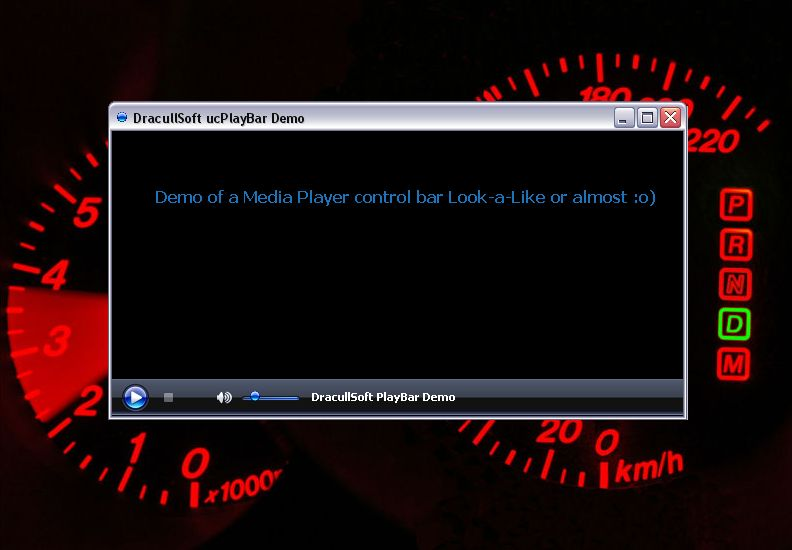



## ucPlayBar \- a MediaPlaybar Control look\-a\-like \( Dracull Soft \) Code

### Description

I made this composite control to mimic the Media player 10 because i wanted to have the same look no matter what mediaplayer version 9,10,11 installed on the machine and at the same time i did not want the FF and REV controls and position Slider.

The control is using Charles P.V's ucSlider and a modified version of the Simple ActiveButton by Gene Martynov.

Graphical resources included.

/Dracull
 
### More Info
 

             |
---                |---
**Submitted On**   |2008-05-23 23:13:22
**By**             |[DracullSoft](https://github.com/Planet-Source-Code/PSCIndex/blob/master/ByAuthor/dracullsoft.md)
**Level**          |Intermediate
**User Rating**    |5.0 (20 globes from 4 users)
**Compatibility**  |VB 5\.0, VB 6\.0
**Category**       |[Custom Controls/ Forms/  Menus](https://github.com/Planet-Source-Code/PSCIndex/blob/master/ByCategory/custom-controls-forms-menus__1-4.md)
**World**          |[Visual Basic](https://github.com/Planet-Source-Code/PSCIndex/blob/master/ByWorld/visual-basic.md)
**Archive File**   |[ucPlayBar\_2113865252008\.zip](https://github.com/Planet-Source-Code/dracullsoft-ucplaybar-a-mediaplaybar-control-look-a-like-dracull-soft-code__1-70581/archive/master.zip)

